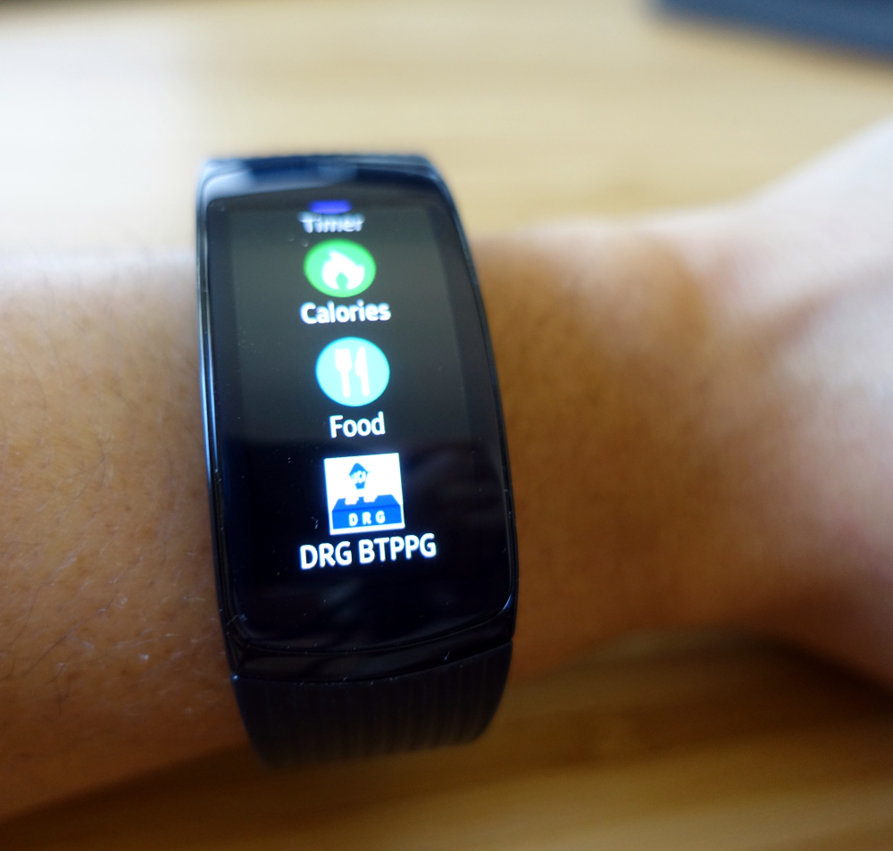
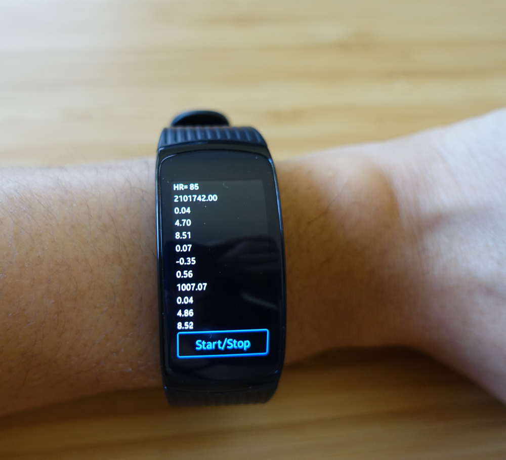
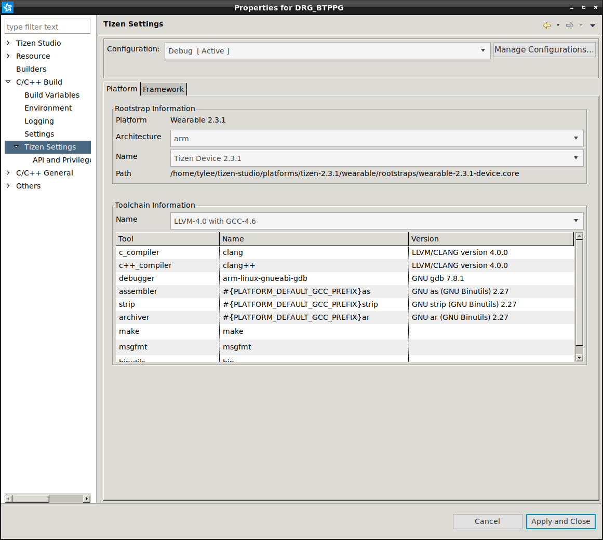
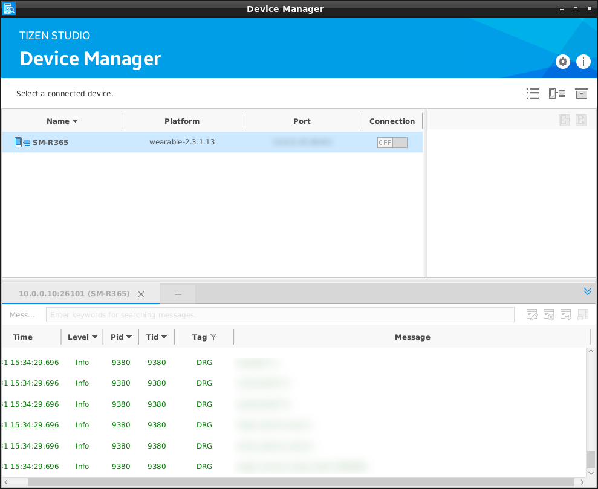
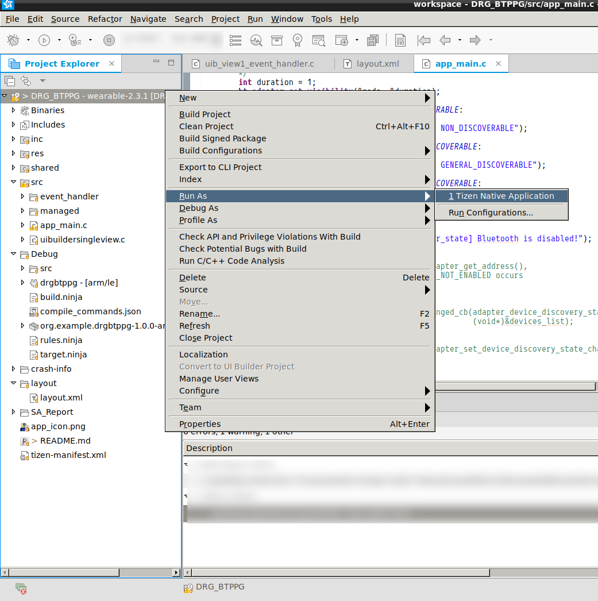

# Dutt Research Group's Samsung Gear Fit 2 Pro Bluetooth Enabled PPG Logger 
# Demo
This app is a single view UI application generated by [Tizen UI builder](https://developer.tizen.org/development/tizen-studio/native-tools/writing-and-editing-code/ui-builder). After installation, you will see an icon named "DRG BTPPG" in your app list:

To start an 1 minute data acquisition, click "Start/Stop." All available sensor data will be updated at 10 Hz refresh rate.
The fields from top to bottom are: 

(Note: For more information, please visit [Tizen Device Sensors](https://developer.tizen.org/development/guides/native-application/location-and-sensors/device-sensors#accelerometer))

1. Heart rate (BPM)
2. Received intensity of PPG green LED  (Min. value = 0, Max. value = 1081216)
3. Accelerometer (X) (in m/s^2)
4. Accelerometer (Y) (in m/s^2)
5. Accelerometer (Z) (in m/s^2)
6. Gyroscope (X) (in Degrees/s (°/s))
7. Gyroscope (Y) (in Degrees/s (°/s))
8. Gyroscope (Z) (in Degrees/s (°/s))
6.  Barometer, i.e. Air pressure (hPa (hectopascals))
6. Gravity (X) (in m/s^2)
7. Gravity (Y) (in m/s^2)
8. Gravity (Z) (in m/s^2))

## Definition of axes
### For heart rate sensor:

* The Heart Rate Monitor (HRM) LED green sensor measures the amount of green light that is reflected back from a person's blood vessel.

### For accelerometer:

### For gyroscope:

# Quick Start
## Tizen Studio 
* Working version of Tizen Studio: Version 2.5 (Built on 2018-06-27 11:50)
* Download: [Tizen Developer Download](https://developer.tizen.org/development/tizen-studio/download#)
### Installation on Arch Linux
#### FontConfig and Harfbuzz workaround

## Build Project
### Sign Your Own App

### Building DRG BTPPG
Environment:

1.  This project is based on Tizen 2.3.1 (the version we've got on SGF2 Model R-365)
2. Build configuration: Use LLVM-4.0 with GCC-4.6 shipped with Tizen Studio

## Installation to Samsung Gear Fit 2
1. Switch on debug mode on Gear Fit 2 via Settings -> Gear Info -> Debugging
2.  Connect SGF2 via device manager

3. Run as "Tizen native application"

# Roadmap
1. v0.1: Basic functionality of data acquisition from sensor
2. v0.2: Use SPP (serial port protocol) to transmit / receive data with a host computer or mobile app via Bluetooth 4.0 (dual-mode)
3. v0.3: Enable Bluetooth LE transmisstion (BT 4.2)
4. v0.4: Add configuration interface to adjust samping rate and select specific axes of data to be recorded
5. TBD: Hook up with DRG lifelogger

# License
Copyright 2018 Michael (Tao-Yi) Lee

Permission is hereby granted, free of charge, to any person obtaining a copy of this software and associated documentation files (the "Software"), to deal in the Software without restriction, including without limitation the rights to use, copy, modify, merge, publish, distribute, sublicense, and/or sell copies of the Software, and to permit persons to whom the Software is furnished to do so, subject to the following conditions:

The above copyright notice and this permission notice shall be included in all copies or substantial portions of the Software.

THE SOFTWARE IS PROVIDED "AS IS", WITHOUT WARRANTY OF ANY KIND, EXPRESS OR IMPLIED, INCLUDING BUT NOT LIMITED TO THE WARRANTIES OF MERCHANTABILITY, FITNESS FOR A PARTICULAR PURPOSE AND NONINFRINGEMENT. IN NO EVENT SHALL THE AUTHORS OR COPYRIGHT HOLDERS BE LIABLE FOR ANY CLAIM, DAMAGES OR OTHER LIABILITY, WHETHER IN AN ACTION OF CONTRACT, TORT OR OTHERWISE, ARISING FROM, OUT OF OR IN CONNECTION WITH THE SOFTWARE OR THE USE OR OTHER DEALINGS IN THE SOFTWARE.
# Contact
Pleae feel free to contact Michael (Tao-Yi) Lee (taoyil AT UCI, pleaes figure out the right top level domain of my university's  email address) for any questions about this Tizen App.

# Acknowledgement
The author would like to thank Arman and Iman for their source code for sensor data acquisition. 
